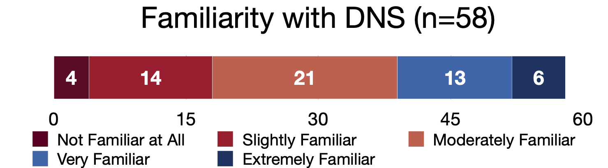
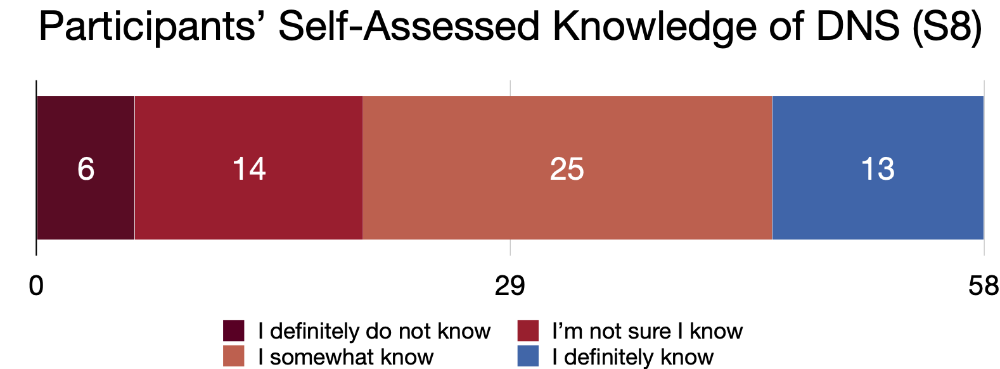

#  User's Knowledge of DNS 

As described in the paper, we assessed participants' familiarity with the Domain Name System (DNS) in question _S7_ (Q3.1 in the QSF files), and their knowledge of DNS based on their responses to questions _S8_ (Q3.2 in QSF) and _S9_ (Q3.3 in QSF). 
This document provides an in-depth description of our procedure for doing so. 

Since questions _S7_ and _S8_ were both Likert resposes, we include their distributions below:

## Users' Self-Indicated Familiarity with and Knowledge of DNS

As a starting point we asked participants whether they were familiar with DNS (S7), and whether they knew how DNS works (S8).
The breakdown of participants' responses are given in the two graphs below. 

      *Fig. 1: Participants' Familiarity with DNS (S7). Overall, most participants (n = 54) indicated having at least some familiarity with DNS.*
      
      

      *Fig. 2: Participants' indicated level of DNS knowledge. A smaller majority of participants (n = 38) indicated they at least somewhat knowing how DNS works.*
 

## Assessing Participant Knowledge and Understanding of DNS

We then asked participants to demonstrate their knowledge of DNS by describing the step-by-step process taken by a computer to navigate to a website (S9).
These responses were then open-coded to capture the knowledge and possible misconceptions exhibited in participants' responses, and then categorized as showing _Low_, _Medium_, _Medium-High_, and _High_ levels of knowledge overall. 

We describe the primary codes used and their grouping in the next two sections. 

### Description of Primary Codes:

* __SDNS (8)__ : This indicated that the response describes SDNS setup or functionality and not that of DNS. 
* __Protocol\_unclear (5)__: This code indicates that it is unclear which protocol the participant is describing in their response (DNS or otherwise). This was often due to a response’s overall lack of detail, its lack of descriptions of key concepts within DNS (or a different protocol), or any key terms that uniquely identified the protocol or process described. 
* __Don't\_know (4)__: This code denoted a participants’ response simply stating they do not know how DNS works and not providing much additional detail.
* __identifies\_pc\_by\_ip (2)__: Responses given this code correctly identify that IP addresses are involved, but focuses on their use to identify Internet end users or their PCs rather than the IP address of the server to which such a user may be trying to navigate.
* __missing\_details (3)__: Response provides an incomplete description of the protocol (to the point where it may be tough to ascertain whether they truly are familiar with the protocol/understand what they’re talking about)
* __navigation\_to\_website (1)__: (Similar to maps\_website\_to\_Internet\_name)
* __maps\_website\_to\_Internet\_name (1)__: indicates understanding that some translation between website (URL?) as shown on screen and how it's routed through the Internet, but does not give more specifics.
* __maps\_ip\_to\_domain (2)__: Correctly IDs what DNS provides mapping between, but has the relationship backwards (i.e. queries domain name that goes w/the IP)
* __translates\_domains\_for\_browsers (2)__: Identify that it provides a translation for a domain name, but not what it's translated to. Also incorrectly indicate its scope is limited to web browsers.
* __maps\_website\_to\_ip (17)__: Correctly identify DNS's high level task/functionality, but fail to distinguish between website/url and domain name
* __maps\_domain\_to\_ip (15)__: Correctly ID that DNS translates btw domain name and IP and that domain=input, IP=response/output
* __query\_dns\_server (2)__: Correctly describes steps for DNS resolution, (but at a higher level/less detail than those labeled __query\_recursive\_dns__ - namely does not talk about the distributed res. process - recursive or iterative)
* __query\_recursive\_dns (12)__: identifies that most deployments of DNS are recursive, often has more detailed step-by-step description of the whole resolution process

### Grouping Codes by Knowledge Level:
Codes were mapped to knowledge level with the following groupings. Descriptions the codes have been repeated for ease of reference: 

#### Low: 
       - SDNS (8) : Response describes SDNS and not DNS
       - Protocol_unclear (5): Unclear what protocol they're describing (DNS or otherwise) often due to lack of detail and no key concepts described
       - Don't_know (4): participant states they do not know how DNS works and do not provide much additional detail.
       - identifies_pc_by_ip (2): IP addresses are involved, but focuses on their use in identifying Internet end users or their PCs
                                  rather than the IP address of the server
       - missing_details (3): Response provides an incomplete description of the protocol (to the point where it may be tough to ascertain whether they truly are familiar with the protocol/understand what they’re talking about)

#### Medium _(Listed roughly from lowest to highest within this category):_
       - navigation_to_website (1): (Similar to maps_website_to_Internet_name)
       - maps_website_to_Internet_name (1): indicates understanding that some translation between website (URL?) as shown on screen and how it's routed 
                                            through the Internet, but does not give more specifics.
       - maps_ip_to_domain (2): Correctly IDs what DNS provides mapping between, but has the relationship backwards 
                                (i.e. queries domain name that goes w/the IP)
       - translates_domains_for_browsers (2): Identify that it provides a translation for a domain name, but not what it's translated to. 
                                              Also incorrectly indicate its scope is limited to web browsers.

#### High _(although roughly ordered from lowest to highest within this category, these codes are not mutually exclusive - i.e. some responses got both):_
       - maps_website_to_ip (17): Correctly identify DNS's high level task/functionality, but fail to distinguish between website/url and domain name
       - maps_domain_to_ip (15): Correctly ID that DNS translates btw domain name and IP and that domain=input, IP=response/output
       - query_dns_server (2): Correctly describes steps for DNS resolution, 
                              (but at a higher level/less detail than those labeled query_recursive_dns -
                              - namely does not talk about the distributed res. process - recursive or iterative)
       - query_recursive_dns (12): identifies that most deployments of DNS are recursive, 
                                   often has more detailed step-by-step description of the whole resolution process
        
        
### Validating Categorization within the Sample:

        
